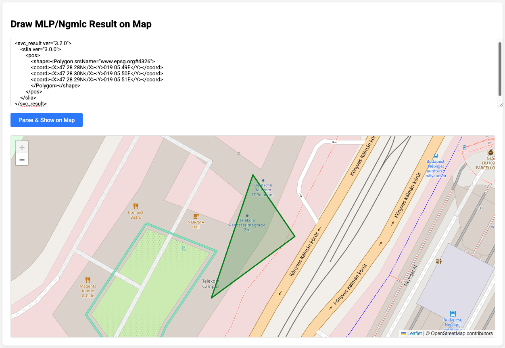
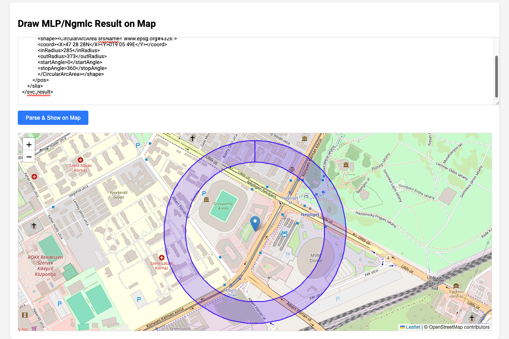
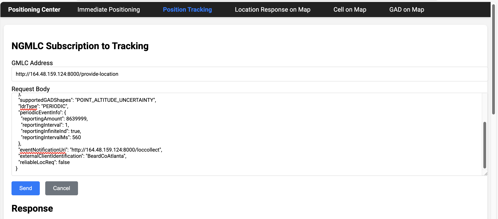

# Positioning-Center


# 📦 Location Mapper - Deployment Guide

**Version:** 1.0.0
**Author:** KAI WANG  
**Updated:** 2025-07-03

---

## ✅ Overview

This is a **standalone binary** application for Location Mapper, providing:

- HTTP server to handle MLP and NGMLC location requests/reponse/location reports
- NGMLC tracking is supposrted
- Draw location reponses/reports on Map
- Frontend web interface for visualization
- Simulated location responses for testing
- Draw shapes on Map, GAD shape is supported
- Draw cell on map(to be supported in the next version)
- Indoor positioning map(to be supported in the next version)

No Python or external dependencies are required. All resources are bundled inside the binary.

## Screenshots

### Map Polygon Example


### Elliptical Area Example


### Main interface


### Tracking Demo


## 🖥 System Requirements

- 64-bit Linux (x86_64)
- Kernel version: 3.x or newer recommended
- Basic Linux utilities: `bash`, `chmod`
- Port `8000` must be available for use

---

## 📂 Delivered Files

| File                        | Description                          |
|-----------------------------|--------------------------------------|
| `location-mapper-linux-x64.bin` | Standalone executable binary         |
| `README.md`                 | This instruction manual              |

---

## 🚀 Quick Start

1. **Grant Execution Permission**

   ```bash
   chmod +x location-mapper-v2.1.6.bin
   ```

2. **Start the Application**

   ```bash
   ./location-mapper-v2.1.6.bin
   ```

   You will see log outputs indicating that the HTTP server has started.

3. **Access the Web Interface**

   Open a browser on the same machine, visit:

   ```
   http://localhost:8000
   ```

   Alternatively, use your server's IP:

   ```
   http://<server-ip>:8000
   ```

Username/password: please contact author


---

## 🔧 Testing Hints

- MLP and NGMLC Immediate modes support internal simulation if you use addresses pointing to your server itself.
- NGMLC Tracking will simulate periodic reports to the configured callback if using internal addresses.

**Note:** This version does NOT connect to real GMLC or location services.

---

## 🛑 Stop the Application

Press `Ctrl + C` in the terminal to gracefully stop the server.

---

## 📝 Additional Notes

- For production deployment or external GMLC integration, contact the development team.
- Tested on Ubuntu 20.04 and CentOS 7.
- Do not modify the binary file directly.

---

## 📧 Support

For issues or questions, please contact:

**KAI WANG**  
Email: kaiwang.e@gmail.com
Version: 1.0.0 - Compiled with Nuitka  
